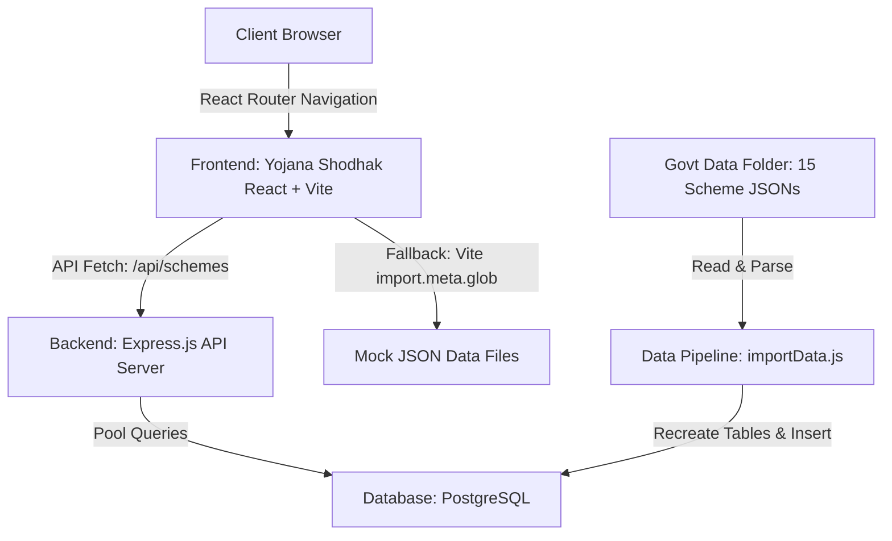

# Yojana Shodhak (Government Schemes Portal) - Project Documentation

Welcome to the comprehensive documentation of **Yojana Shodhak (योजना शोधक)**, a full-stack portal designed to list, detail, and check eligibility for Indian Government schemes. The system is designed with dual-language support (Marathi & English) and prioritizes clean UX/UI and accessibility.

This document walks through every component, script, database schema, and frontend screen step-by-step.

---

## 1. High-Level Architecture

The project consists of three main components:
1. **Raw Government Data (`govt-data/`)**: A folder containing 15 JSON files, each representing a detailed government scheme.
2. **Backend Server (`backend/`)**: Built using **Node.js, Express, and PostgreSQL** to parse raw data, import it, and expose it via API endpoints.
3. **Frontend Application (`yojana-shodhak/`)**: A client app built with **React, Vite, and Lucide React** that queries the Express API, falls back to mock JSON files if the API is offline, and provides interactive eligibility wizards.



---

## 2. Directory Structure

Below is the directory layout of the repository and the purpose of each key file:

```text
schemes/
├── backend/
│   ├── .env                      # Database configuration and port settings
│   ├── db.js                     # PostgreSQL connection pooling using pg.Pool
│   ├── schema.sql                # Initial schema definitions (schemes, eligibility, benefits, etc.)
│   ├── importData.js             # Script to parse govt-data JSONs and populate Postgres
│   ├── server.js                 # Express API server exposing endpoints
│   ├── package.json              # Node dependencies for backend (express, pg, cors, dotenv)
│   └── govt-data-main.zip        # Backup zip of the government scheme JSONs
│
├── govt-data/                    # Directory containing raw government scheme JSON definitions
│   ├── Agro Service Provider Scheme.json
│   ├── Ayushman Bharat.json
│   ├── awas.json
│   └── ... (15 schemes total)
│
└── yojana-shodhak/               # Frontend directory (React + Vite project)
    ├── vite.config.js            # Vite build configuration
    ├── package.json              # Client dependencies (React 19, React Router v7, Lucide Icons)
    ├── index.html                # Entry point HTML file
    └── src/
        ├── main.jsx              # Mounts App component to DOM
        ├── App.jsx               # Client Router & layout structure (Navbar + Footer wrap)
        ├── index.css             # Core design system styles (CSS variables, buttons, cards)
        ├── App.css               # Supporting style updates
        ├── components/
        │   ├── Navbar.jsx        # Sticky top header with Logo, links, and Mock Login/Language buttons
        │   └── Footer.jsx        # Footer containing feedback form and standard links
        ├── data/
        │   ├── schemeData.js     # Fallback parser using Vite glob import to parse local JSONs
        │   └── schemes/          # Local copy of JSON files for offline/fallback operation
        └── pages/
            ├── Home.jsx                    # Landing page with scheme search, marquee notices, and eligibility CTA
            ├── SchemeDetails.jsx           # Dynamic detail page for individual schemes
            ├── WomenEligibility.jsx        # Interactive form wizard to check eligibility for women
            ├── FarmerEligibility.jsx       # Interactive form wizard to check eligibility for farmers
            ├── SeniorCitizenEligibility.jsx# Interactive form wizard to check eligibility for senior citizens
            ├── MyApplications.jsx          # Mock page representing user's applied schemes list
            └── Contact.jsx                 # Contact form to reach support
```

---

## 3. Database Schema

The database is built on **PostgreSQL**. Its design supports highly nested scheme details, separating them into distinct tables linked with Foreign Keys.

> [!NOTE]
> All child tables utilize `ON DELETE CASCADE` on `scheme_id` to ensure database integrity if a scheme is deleted.

### Tables Breakdown
1. **`schemes`**: Stores core characteristics of the scheme.
   - `id`: Auto-incrementing primary key.
   - `scheme_name_mr` & `scheme_name_en`: Support for Marathi and English titles.
   - `short_name`: Abbreviation (e.g., PMAY).
   - `launched_by`, `launch_date`, `official_website`, `helpline`, `nodal_ministry`, `implementing_agency`, `scheme_type`, `description`.
2. **`eligibility_criteria`**: Holds requirements needed to qualify.
   - Contains fields for criteria names, details, and requirement status (`is_required`).
3. **`benefits`**: Lists the financial or structural perks.
   - Holds name and descriptions of benefits.
4. **`documents_required`**: Keeps track of necessary paperwork.
   - Distinguishes between `mandatory` and `verification` document types.
5. **`disqualification_criteria`**: Lists factors that make users ineligible.
   - Standard reasons (e.g., being a tax payer or a government employee).
6. **`application_steps`**: Sequential guide for the application process.
   - Houses the step numbers and detailed instructions.
7. **`notifications`**: Dynamic system alerts/notices for the dashboard.

---

## 4. The Data Ingestion Pipeline (`importData.js`)

The project implements an ingestion pipeline in `backend/importData.js` to parse raw unstructured JSON schemes from `govt-data/` and insert them into the PostgreSQL database.

### Ingestion Flow:
1. **Clean Database**: It executes a batch of queries dropping existing tables and creating them fresh based on the schema.
2. **Scan Directory**: Scans the `govt-data` directory and filters out `.json` files.
3. **Parse and Normalize**: Reads each JSON file and handles varying formats:
   - Extract title: Checks if marathi/english/name keys exist.
   - Extract objective: Falls back to default values if not defined.
4. **Insert Schemes**: Inserts the primary scheme row first and returns the `id` (`RETURNING id`) to reference in child tables.
5. **Insert Relations**:
   - Loops over `eligibility_criteria` and diverts any `excluded_categories` to the `disqualification_criteria` table.
   - Parses benefits amounts/installments, creating clean descriptive strings.
   - Splits documents into `mandatory` and `verification` types.
   - Evaluates multi-formatted steps (like step prefix objects, direct lists, online/offline arrays, or strings) and inserts them in order into `application_steps`.

## 5. Backend Server API

The backend (`server.js`) utilizes Express to serve the PostgreSQL data and supports full CRUD operations.

### API Endpoint Specifications:

| Method | Endpoint | Description | Return Format |
| :--- | :--- | :--- | :--- |
| **GET** | `/api/schemes` | Retrieve all schemes for listing | JSON Array |
| **GET** | `/api/schemes/:id` | Get individual scheme details with combined related tables | JSON Object |
| **GET** | `/api/schemes/:id/disqualifications` | Get only disqualification reasons for a scheme | JSON Array of strings |
| **POST** | `/api/schemes` | Create/import a new scheme along with its related tables | JSON Object `{ message, id }` |
| **PUT** | `/api/schemes/:id` | Update an existing scheme and overwrite related tables | JSON Object `{ message }` |
| **DELETE** | `/api/schemes/:id` | Delete a scheme and cascade delete all related tables | JSON Object `{ message }` |
| **POST** | `/api/check-eligibility` | Evaluates eligibility parameters (Mock logic) | JSON Object `{ eligible: bool, reasons: [] }` |

---

## 6. Frontend Architecture & Design

### Custom Styling (`index.css`)
The frontend uses vanilla CSS with CSS variables declaring theme tokens:
* Saffron/Orange Accent (`--color-accent`): representative of local branding.
* Navy Blue Base (`--color-primary`): provides professional posture.
* Smooth gradients, glassmorphism, hover scaling, and marquee keyframe animations ensure a modern interface.

### Fallback Mode
In `yojana-shodhak/src/data/schemeData.js`, a fallback parser utilizes Vite’s native `import.meta.glob('./schemes/*.json', { eager: true })` to allow the frontend to run fully client-side using mock JSONs if PostgreSQL or the Express server is offline. This ensures the app is highly resilient.

### Page Components:
* **`Home.jsx`**: Features search filtering, marquee notices, categorized tabs, scheme grid, and eligibility redirects.
* **`SchemeDetails.jsx`**: Parses dynamic data formats dynamically using helper function `renderVal()`. Renders lists, tables, key-value configurations, and interactive warning blocks for disqualification criteria.
* **`WomenEligibility.jsx`**, **`FarmerEligibility.jsx`**, & **`SeniorCitizenEligibility.jsx`**: Interactive step-by-step forms with progress bars, icons, custom inputs, and dynamic guidance text.

---

## 7. Step-by-Step Run Guide

### Prerequisites
* **Node.js** (v16+ recommended)
* **PostgreSQL** database server running locally or remotely

---

### Step 1: Database Setup
Create a database named `abc` (or as configured in your `.env` file) in PostgreSQL.
Initialize the tables by running:
```bash
psql -U postgres -d abc -f backend/schema.sql
```
*(Alternatively, the import script automatically drops and rebuilds tables, so creating the database shell is sufficient).*

---

### Step 2: Configure Environment Variables
Inside the `backend/` directory, create a `.env` file containing:
```env
DB_USER=postgres
DB_PASSWORD=YOUR_POSTGRES_PASSWORD
DB_HOST=localhost
DB_PORT=5432
DB_NAME=abc
PORT=5000
```

---

### Step 3: Install Backend Dependencies & Import Data
Open a terminal in the `backend/` directory:
```bash
# Install required Node packages
npm install

# Run the import data pipeline script
npm run import-data
```
You should see a console confirmation detailing the import of all 15 JSON files.

---

### Step 4: Run Backend Express Server
From the `backend/` directory:
```bash
npm start
```
The server will boot up and listen on port `5000`.

---

### Step 5: Install Frontend Dependencies & Run
Open a new terminal in the `yojana-shodhak/` directory:
```bash
# Install frontend packages
npm install

# Start Vite dev server
npm run dev
```
Open the local browser link (typically `http://localhost:5173`) to view the application in action.

---

## 8. Summary Checklist for Future Development
* [ ] **Connect Frontend forms to Eligibility API**: Connect the Wizards to send `POST` requests to `/api/check-eligibility`.
* [ ] **Localization System**: Fully integrate a state management variable to toggle all display texts dynamically between English and Marathi.
* [ ] **Interactive Applications**: Implement storage database tables to record user applications when they click "Apply Now".
* [ ] **SMS/Email Alerts**: Wire notification updates to send SMS alerts using nodal helper services.
